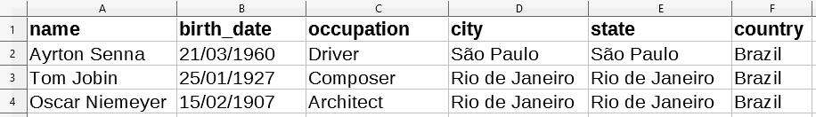

# csv2rdf
This project is a tool for converting CSV files into RDF triples.

# Project file structure

```
csv2rdf/
├── csv2rdf.jar 
├── application.yml 
├── mapping.jsonld 
├── ontology.owl 
├── csv 
│   └── *.csv (one or more files)
└── rdf 
    └── output.rdf (one or more files)
```

### csv2rdf.jar is an executable jar file. It is executed by command line:

```
java -jar csv2rdf.jar
```
Releases are available [here](https://github.com/ivansalvadori/csv2rdf/releases).


### application.yml is a configuration file for setting up the following properties:

#### csvFilesFolder:
The path for CSV files. All files inside this folder will be processed.

#### csvEncode: 
The character encoding for CSV file(s).
Valid enconding:

```
ISO-8859-1
US-ASCII
UTF-16
UTF-16BE
UTF-16LE
UTF-8
```

####  csvSeparator: 
The token used to separate CSV values. For tabular separator use "TAB".

#### rdfFolder: 
The path for the output RDF file(s).

#### rdfFormat: 
The RDF serialization format. 

Valid formats:
```
RDF/XML
N-TRIPLE
TURTLE or TTL 
N3
```

#### rdfEncode: 
The character encoding for RDF output file(s).

Valid enconding:
```
ISO-8859-1
US-ASCII
UTF-16
UTF-16BE
UTF-16LE
UTF-8
```

#### ontologyFormat: 
The ontology serialization format. 
The ontology file is optional.

Valid formats:
```
RDF/XML
N-TRIPLE
TURTLE or TTL 
N3
```

####  writeToFile: 
Write the RDF output to file.
It is possible to use csv2rdf as a developing library.
Therefore, this property keep the resulting RDF materialization in memory.

Valid values:
```
true
false
```

####  singleRdfOutputFile:
This property sets if all the resulting RDF triples will be written in a single file. This property is only applied when writeToFile:true.

Valid values:
```
true
false
```

#### resourcesPerFile:
The number of resources (RDF individual) for each output file.  This property is only applied when singleRdfOutputFile:false.


#### processWhenStarted:
When csv2rdf is used as developing library, the developer may want to control when to start de convertion process.
For using csv2rdf as a tool, set this property true. Then, the convertion process will start immediatly.

Valid values:
```
true
false
```

### mapping.jsonld 
This file is used to map CSV headers to semantic properties of a given ontology.
the maping is represented in JSON-LD (JSON Linked Data).


# How it works?

Lets take as example a CSV file that contians information about notable people from Brazil:

```
name,email,birth_date,occupation,city,state,country
Tom Jobin,tom@jobin.com.br,25/01/1927,Composer,Rio de Janeiro,Rio de Janeiro,Brazil
Ayrton Senna,ayrton@senna.com.br,21/03/1960,Driver,São Paulo,São Paulo,Brazil
Oscar Niemeyer,oscar@niemeyer.com.br,15/02/1907,Architect,Rio de Janeiro,Rio de Janeiro,Brazil
```
A more friendly representation:



application.yml:

```
config:
  csvFilesFolder: "csv/"
  csvEncode: "UTF-8"
  csvSeparator: ","
  rdfFolder: "rdf/"
  rdfFormat: "Turtle"
  rdfEncode: "UTF-8"
  ontologyFormat: "N3"
  writeToFile: true
  singleRdfOutputFile: true
  resourcesPerFile: 100
  processWhenStarted: true
```
mapping.jsonld:
```
{
  "@context": {
    "@type": "http://ontoloy/Person",
    "@uriProperty": "@GenerateUri",
    "name": "http://ontoloy/name",
    "birth_date": "http://ontoloy/birthDate",
    "occupation": "http://ontoloy/occupation",
    "city": "http://ontoloy/cityName",
    "state": "http://ontoloy/stateName",
    "country": "http://ontoloy/countryName"
  },
  "@resourceDomain": "http://www.example.com"
}
```
Results in a single RDF output file containing:


```
<http://www.example.com/95ee8342ade8e7566a3a5413>
        a                             <http://ontoloy/Person> ;
        <http://ontoloy/birthDate>    "21/03/1960" ;
        <http://ontoloy/cityName>     "São Paulo" ;
        <http://ontoloy/countryName>  "Brazil" ;
        <http://ontoloy/name>         "Ayrton Senna" ;
        <http://ontoloy/occupation>   "Driver" ;
        <http://ontoloy/stateName>    "São Paulo" .

<http://www.example.com/a1fcbc1222c25937952b65501>
        a                             <http://ontoloy/Person> ;
        <http://ontoloy/birthDate>    "25/01/1927" ;
        <http://ontoloy/cityName>     "Rio de Janeiro" ;
        <http://ontoloy/countryName>  "Brazil" ;
        <http://ontoloy/name>         "Tom Jobin" ;
        <http://ontoloy/occupation>   "Composer" ;
        <http://ontoloy/stateName>    "Rio de Janeiro" .

<http://www.example.com/2a7d2526207b7fccf86bb11933>
        a                             <http://ontoloy/Person> ;
        <http://ontoloy/birthDate>    "15/02/1907" ;
        <http://ontoloy/cityName>     "Rio de Janeiro" ;
        <http://ontoloy/countryName>  "Brazil" ;
        <http://ontoloy/name>         "Oscar Niemeyer" ;
        <http://ontoloy/occupation>   "Architect" ;
        <http://ontoloy/stateName>    "Rio de Janeiro" .


```

It is important to mention that the ontology is optional.
All semantic properties used to map CSV headers will be used regardless a formal and explicit definition.
The mapping contains four reserveds words:

#### @type 
Used to associate each CSV record to a semantic class.

#### @uriProperty 
Used to define the resource URI.
It accepts two type of values:
 * @GenerateUri: generates a unique URI for each resource.  
 * Array of CSV headers: generats a URI based on headers. CSV records that contain the same value for the predefind headers will be merged to a single resource.
 
#### @resourceDomain
Used to define a domain for resources.


## Linked Resources

It is possible to create a more complex RDf materializtions.
The following mapping associates a CSV record to two distinct and linked resources.
The CSV headers "name", "birth_date" and "occupation" are mapped to a resource instance of "http://ontoloy/Person".
The CSV headers "city", "state", and "country" are mapped to a resource instance of "http://ontoloy/Place".
These resources are linked with one another by the property "http://ontoloy/birthPlace".

mapping.jsonld:
```
{
  "@context": {
    "@type": "http://ontoloy/Person",
    "@uriProperty": "@GenerateUri",
    "name": "http://ontoloy/name",
    "birth_date": "http://ontoloy/birthDate",
    "occupation": "http://ontoloy/occupation",
    "http://ontoloy/birthPlace":{
	    "@type": "http://ontoloy/Place",
	    "@uriProperty": ["city", "state"],
	    "city": "http://ontoloy/cityName",
	    "state": "http://ontoloy/stateName",
	    "country": "http://ontoloy/countryName"
    }   
  },
  "@resourceDomain": "http://www.example.com"
}
```

The resulting materialization:

```
<http://www.example.com/efe981d95d663e5afe073648c77010>
        a                            <http://ontoloy/Person> ;
        <http://ontoloy/birthDate>   "21/03/1960" ;
        <http://ontoloy/birthPlace>  <http://www.example.com/fb8dd88813111acdbcc057de1dd8> ;
        <http://ontoloy/name>        "Ayrton Senna" ;
        <http://ontoloy/occupation>  "Driver" .
        
<http://www.example.com/fb8dd88813111acdbcc057de1dd8>
        a                             <http://ontoloy/Place> ;
        <http://ontoloy/cityName>     "São Paulo" ;
        <http://ontoloy/countryName>  "Brazil" ;        
        <http://ontoloy/stateName>    "São Paulo" .
        
<http://www.example.com/3bb2ca77d7adfdfac33eb4670d4f55>
        a                            <http://ontoloy/Person> ;
        <http://ontoloy/birthDate>   "25/01/1927" ;
        <http://ontoloy/birthPlace>  <http://www.example.com/691bb0ee4ccf6675e7a37a1a2665094a7949> ;
        <http://ontoloy/name>        "Tom Jobin" ;
        <http://ontoloy/occupation>  "Composer" .

<http://www.example.com/d486f2ab864536cff91f4a9d1f4635700>
        a                            <http://ontoloy/Person> ;
        <http://ontoloy/birthDate>   "15/02/1907" ;
        <http://ontoloy/birthPlace>  <http://www.example.com/691bb0ee4ccf6675e7a37a1a2665094a7949> ;
        <http://ontoloy/name>        "Oscar Niemeyer" ;
        <http://ontoloy/occupation>  "Architect" .

<http://www.example.com/691bb0ee4ccf6675e7a37a1a2665094a7949>
        a                             <http://ontoloy/Place> ;
        <http://ontoloy/cityName>     "Rio de Janeiro" ;
        <http://ontoloy/countryName>  "Brazil" ;        
        <http://ontoloy/stateName>    "Rio de Janeiro" .
```


## InverseOf property

````
@prefix rdf:  <http://www.w3.org/1999/02/22-rdf-syntax-ns#> .
@prefix rdfs: <http://www.w3.org/2000/01/rdf-schema#> .
@prefix owl:  <http://www.w3.org/2002/07/owl#> .
@prefix onto:  <http://ontoloy/> .
 
onto:Person a owl:Class .
onto:Place a owl:Class .
onto:Country a owl:Class .

onto:birthPlace a rdf:Property .
onto:isBirthPlaceOf a rdf:Property .
onto:birthPlace owl:inverseOf  onto:isBirthPlaceOf .

````


```
<http://www.example.com/efe981d95d663e5afe073648c77010>        
        <http://ontoloy/name>        "Ayrton Senna" ;
         <http://ontoloy/birthPlace>  <http://www.example.com/fb8dd88813111acdbcc057de1dd8> ;        
         ...
        
<http://www.example.com/fb8dd88813111acdbcc057de1dd8>
        a                             <http://ontoloy/Place> ;
        <http://ontoloy/cityName>     "São Paulo" ;
        <http://ontoloy/countryName>  "Brazil" ;        
        <http://ontoloy/stateName>    "São Paulo" ;
        <http://ontoloy/isBirthPlaceOf>
                <http://www.example.com/efe981d95d663e5afe073648c77010> ;
        
<http://www.example.com/3bb2ca77d7adfdfac33eb4670d4f55>
        <http://ontoloy/name>        "Tom Jobin" ;
        <http://ontoloy/birthPlace>  <http://www.example.com/691bb0ee4ccf6675e7a37a1a2665094a7949> ;
        ...
        

<http://www.example.com/d486f2ab864536cff91f4a9d1f4635700>
        <http://ontoloy/birthPlace>  <http://www.example.com/691bb0ee4ccf6675e7a37a1a2665094a7949> ;
        <http://ontoloy/name>        "Oscar Niemeyer" ;
        ...

<http://www.example.com/691bb0ee4ccf6675e7a37a1a2665094a7949>
        a                             <http://ontoloy/Place> ;
        <http://ontoloy/cityName>     "Rio de Janeiro" ;
        <http://ontoloy/countryName>  "Brazil" ;        
        <http://ontoloy/stateName>    "Rio de Janeiro" .
        <http://ontoloy/isBirthPlaceOf>
                <http://www.example.com/3bb2ca77d7adfdfac33eb4670d4f55>,
                <http://www.example.com/d486f2ab864536cff91f4a9d1f4635700>
```
